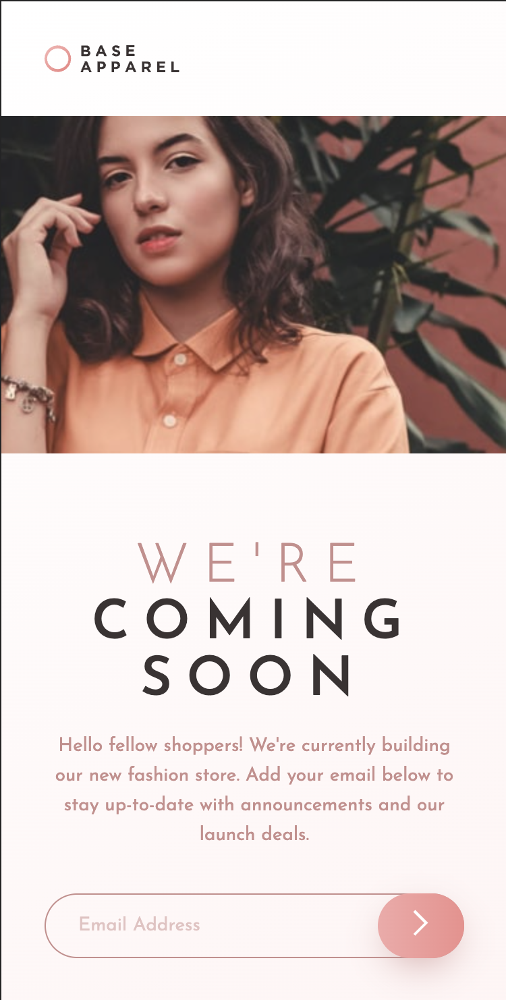

# Base Apparel coming soon

## Table of contents

- [Overview](#overview)
  - [The challenge](#the-challenge)
  - [Links](#links)
  - [Screenshot](#screenshot)
- [My process](#my-process)
  - [Built with](#built-with)
- [Author](#author)

## Overview

### The challenge

Users should be able to:

- View the optimal layout for the site depending on their device's screen size
- See hover states for all interactive elements on the page
- Receive an error message when the `form` is submitted if:

  - The `input` field is empty
  - The email address is not formatted correctly

### Links

- Live Demo: [https://aaronkagandev-base-apprarel.netlify.app/](https://aaronkagandev-base-apprarel.netlify.app/)

### Screenshot

## My process

### Built with

- Semantic HTML
- SCSS
- CSS Grid
- Mobile-first workflow

## Author

- Portfolio - [aaronkagan.dev](https://www.aaronkagan.dev)
- Linkedin - [/aaron-kagan](https://www.linkedin.com/in/aaron-kagan/)
- X - [@aaronkagandev](https://www.twitter.com/aaronkagandev)
- Instagram - [aaronkagandev](https://www.instagram.com/aaronkagandev/)
